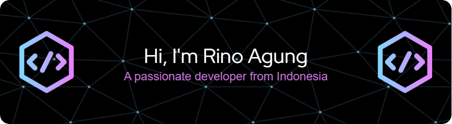

<!-- <h1 align="center">Hi 👋, I'm Rino Agung</h1>
<h3 align="center">A passionate developer from Indonesia</h3> -->

<!-- 

  

 -->

<!-- -   🔭 I’m currently working on **[Nama Proyek atau Fokus Saat Ini]**

-   🌱 I’m currently learning **[Teknologi/Bahasa yang Sedang Dipelajari]**

-   💬 Ask me about **[Topik yang Kamu Kuasai]**

-   📫 How to reach me **[Email atau Link Sosial Media]**

-   ⚡ Fun fact **[Fakta Menarik tentang Kamu]** -->

  

---

<picture>
  <source media="(prefers-color-scheme: dark)" srcset="https://raw.githubusercontent.com/rinoagung/rinoagung/output/pacman-contribution-graph-dark.svg">
  <source media="(prefers-color-scheme: light)" srcset="https://raw.githubusercontent.com/rinoagung/rinoagung/output/pacman-contribution-graph.svg">
  
</picture>

### 📊 Most Used Languages

  

<!-- ### 📈 GitHub Stats

  

 -->

---

## 🛠️ Skills & Tools

 

### 💻 Programming Languages

	
	
	
	
	

 

### 🗄️ Databases

	
	
	
	

 

### 🌐 Web Frameworks & Tools

	
	
	
	
	
	
	

 

### 📱 Mobile Frameworks

	
	

 

### 🧰 Tools & Platforms

	
	
	
	
	
	
	
	
	

---

### 🔗 Connect with me

  
  
  
  

